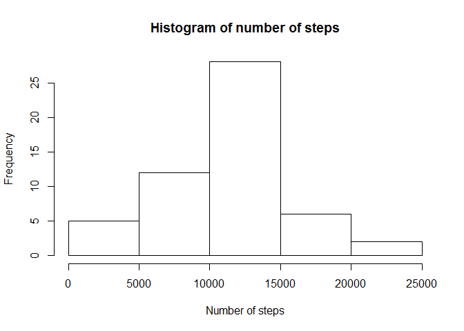
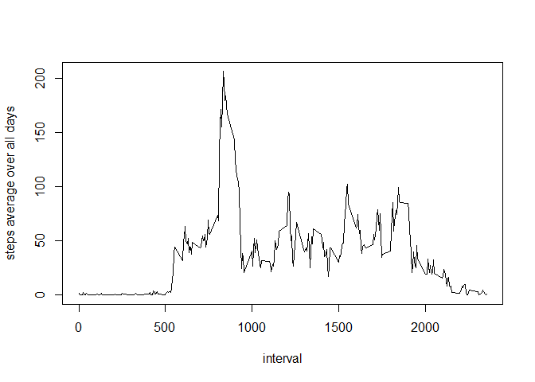
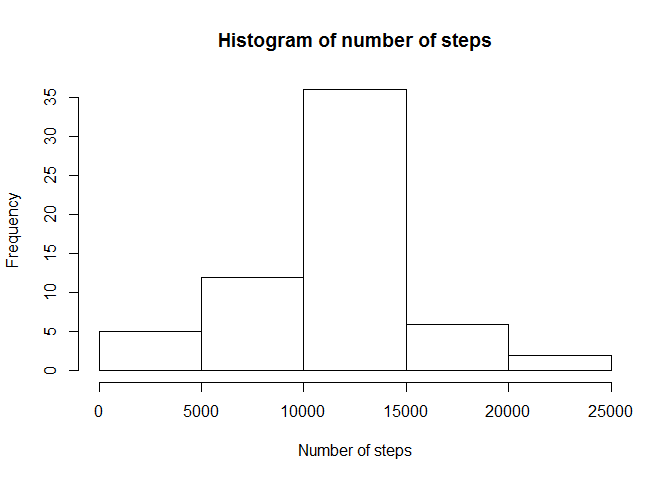

# Reproducible Research: Peer Assessment 1

##Loading and preprocessing the data

Code for loading the data. The "date" variable is classed as strings originally, it might be useful to convert them into date class.


```r
unzip("activity.zip")
activitydata<-read.csv("activity.csv", stringsAsFactors=FALSE)
activitydata$date<-as.Date(activitydata$date)
```

##What is mean total number of steps taken per day?

First removing missing values and then calculating the total number of steps per day:


```r
compdata<-activitydata[complete.cases(activitydata),]
library(dplyr)
```

```
## 
## Attaching package: 'dplyr'
## 
## The following objects are masked from 'package:stats':
## 
##     filter, lag
## 
## The following objects are masked from 'package:base':
## 
##     intersect, setdiff, setequal, union
```

```r
perday<-group_by(compdata,date)
total<-summarize(perday,steps=sum(steps))
```

A histogram shows which amounts of steps per are the most frequent.


```r
hist(total$steps,xlab="Number of steps",main="Histogram of number of steps")
```

 

Calculating the mean and median of the total number of steps taken per day:


```r
mean(total$steps)
```

```
## [1] 10766.19
```

```r
median(total$steps)
```

```
## [1] 10765
```

##What is the average daily activity pattern?

This plot shows how active the subject is on average during different parts of the day.

```r
perinterval<-group_by(activitydata,interval)
average<-summarize(perinterval,steps=mean(steps,na.rm=TRUE))
plot(average$interval,average$steps,type="l",xlab="interval",ylab="steps average over all days")
```

 

The interval corresponding to the maximum number of steps is calculated to be interval number 835 (8:35-8:40 am)

```r
average[which.max(average$steps),]
```

```
## Source: local data frame [1 x 2]
## 
##   interval    steps
## 1      835 206.1698
```

##Imputing missing values

The total number of missing values in the dataset:


```r
sum(is.na(activitydata$steps))
```

```
## [1] 2304
```

When there is a missing value, we can estimate it by taking the mean value for that interval of the other days. However since there are still a lot of 

A new dataset called imputeddata is created, where this is done.


```r
imputeddata<-activitydata
for(i in 1:length(is.na(imputeddata$steps))){
  if(is.na(imputeddata$steps[i])){
    imputeddata$steps[i]<-average$steps[average$interval==imputeddata$interval[i]]
    }
}
```

A histogram for this new dataset, along with the new mean and median


```r
perday2<-group_by(imputeddata,date)
total2<-summarize(perday2,steps=sum(steps))
hist(total2$steps,xlab="Number of steps",main="Histogram of number of steps")
```

 

```r
mean(total2$steps)
```

```
## [1] 10766.19
```

```r
median(total2$steps)
```

```
## [1] 10766.19
```

We see that the mean and the median are now the same number, meaning that the median has increased slightly. More values are not concentrated around the center in the histogram as well, making the outliers seem less significant.

##Are there differences in activity patterns between weekdays and weekends?

Now we add a new factor column which indicates whether the day is a weekday or a weekend.


```r
imputeddata$weekday<-(weekdays(imputeddata$date)=="lördag"|weekdays(imputeddata$date)=="söndag")
imputeddata$weekday<-ifelse(imputeddata$weekday,"weekend","weekday")
imputeddata$weekday<-factor(imputeddata$weekday)
```

And finally, let's compare the behaviour on weekdays vs weekends


```r
library(lattice)
perinterval2<-group_by(imputeddata,interval,weekday)
average2<-summarize(perinterval2,steps=mean(steps))
xyplot(steps~interval|weekday,data=average2,type="l",layout=c(1,2))
```

 

From the graphs it appears that there is a bit more moveement in the middle of the days during weekends.
